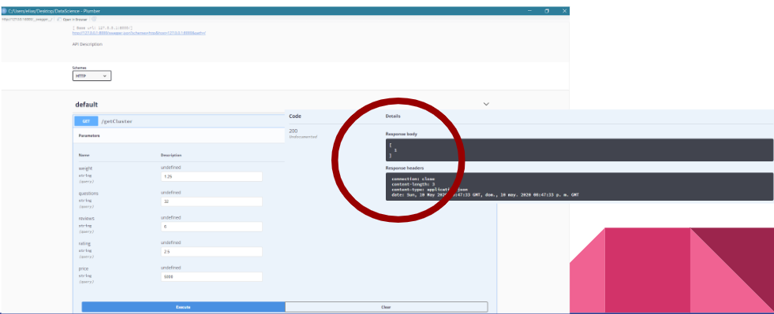
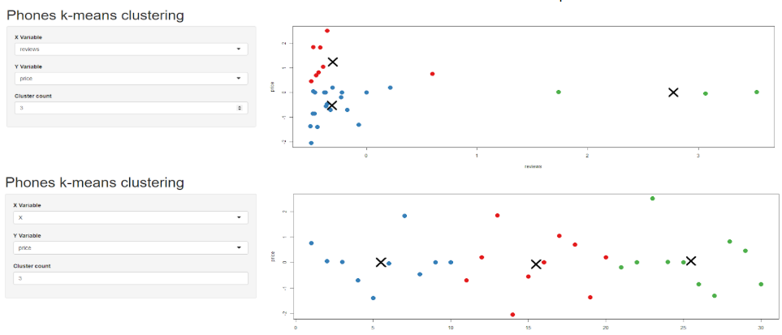

# Un caso de estudio aplicando conceptos de DataScience

Para el desarrollo del proyecto se tomo como base lo siguiente:

> La compañía Patito quiere iniciar operaciones en México, lanzará una nueva línea de equipos celulares por lo que requiere de hacer un análisis de mercado para tomar decisiones que le ayuden a competir

Los pasos a realizar van en orden secuencial del 0 al 5 en el código, mismos que se describen, el caso completo se puede ver dentro del PDF incluído:
[PDF del caso de estudio ficticio para la empresa patito](/WebScraping%20y%20Clusterizacion.pdf)
Para ello se realizó lo siguiente:

## 0 - Scraper
Se identificaron posibles variables a extraer y se realizaron funciones para obtener la información:

* build_pagination_pages - Construye las páginas a consultar
* get_page_links - Obtiene los enlaces a los productos, en este caso de los celulares
* get_selector_text y get_selector_table - Configuran los selectores para la extracción de texto y tablas dentro del sitio
* get_product - Obtiene los datos del producto a extraer y lo deposita en un DataFrame para su revisión

Requiere el paquete RVEST

## 1 - Extracción

Se configuran las variables, indicando el sitio, termino a búscar y la estructura del paginador, así como la cantidad de páginas

```r
base_url = "https://www.amazon.com.mx"
uri = "/s?k=celulares"
page = "&page=x"
start = 1
end = 5
```

Posteriormente se ejecutan los comandos que llaman a las funciones del scraper y se guarda en un csv

## 2 - Limpieza y transformaciones

La información no viene como la queremos, por lo que hay que limpiar y corregir ciertos valores

## 3 - Se prueba el modelo no supervisado K-means para poder clasificar los productos

Para ello el dataset toma unicamente los valores continuos excluyendo factores del dataset para poder trabajar, y se realizan visualizaciones sencillas

## 4 - Montar una API con Plumber

Con nuestro modelo, ahora con ayuda de Plumber podemos montar una API que al ingresar nuevos datos nos de el clúster al que pertenece acorde a las variables de entrada

<div align="center">
  
</div>

## 5 - Montar un sitio web con Shiny

Finalmente se implementa el algoritmo con Shiny para desplegar nuestras variables en una herramienta visual e interactiva

<div align="center">
  
</div>

# ¿Cómo contribuir?

Enviame un pull request o contactame como eocode en redes sociales
